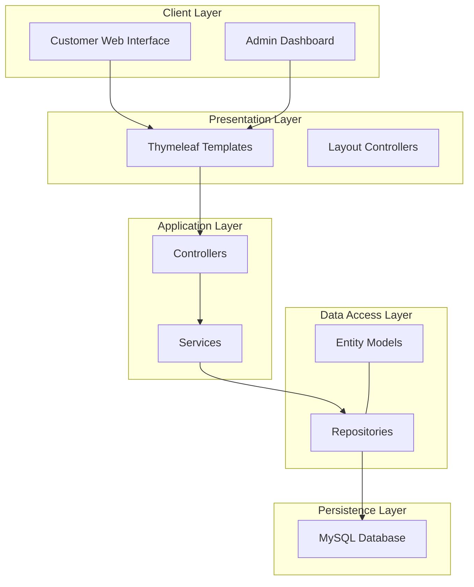

<h1 class="group flex items-center">FANFOOTBALL - Soccer Equipment E-commerce Website  </h1>
<h2 class="group flex items-center">Overview  </h2>

FANFOOTBALL is a comprehensive e-commerce platform dedicated to soccer/football equipment. Built with Spring Boot, this application provides a complete solution for both customers and administrators to manage an online store for soccer gear.

<h2 class="group flex items-center">Features  </h2>
<h3 class="group flex items-center">Customer Features  </h3>
<ul>
<li><strong>User Authentication</strong>
<ul>
<li>Local authentication with username/password</li>
<li>OAuth2 integration with Google application.properties:22-26</li>
</ul>
</li>
<li><strong>Product Browsing</strong>
<ul>
<li>Category-based navigation</li>
<li>Brand filtering</li>
<li>Price range filtering</li>
<li>Search functionality</li>
<li>Responsive product grid layout category.html:46-49</li>
</ul>
</li>
<li><strong>Product Details</strong>
<ul>
<li>Comprehensive product information</li>
<li>Multiple product images</li>
<li>Size selection</li>
<li>Add to cart functionality</li>
<li>Product reviews and ratings</li>
</ul>
</li>
<li><strong>Shopping Cart</strong>
<ul>
<li>Add/remove products</li>
<li>Update quantities</li>
<li>Size selection</li>
<li>Cart total calculation layout.html:107</li>
</ul>
</li>
<li><strong>Checkout Process</strong>
<ul>
<li>Multiple payment methods</li>
<li>Order summary</li>
<li>Shipping information</li>
<li>Order confirmation</li>
</ul>
</li>
<li><strong>User Profile Management</strong>
<ul>
<li>View and edit personal information</li>
<li>Address management</li>
<li>Password changes profile.html:7-13</li>
</ul>
</li>
<li><strong>Order History</strong>
<ul>
<li>View past orders</li>
<li>Order status tracking</li>
<li>Order details order-detail.html:9-19</li>
</ul>
</li>
<li><strong>News/Blog Section</strong>
<ul>
<li>Sports news and updates</li>
<li>Product guides and information NewsController.java:36-52</li>
</ul>
</li>
</ul>
<h3 class="group flex items-center">Admin Features  </h3>
<ul>
<li><strong>Dashboard</strong>
<ul>
<li>Sales overview</li>
<li>Recent orders</li>
<li>Stock alerts</li>
<li>User statistics</li>
</ul>
</li>
<li><strong>Product Management</strong>
<ul>
<li>Add/edit/delete products</li>
<li>Manage product images</li>
<li>Set product categories and brands</li>
<li>Inventory management list.html:53 create.html:105-108</li>
</ul>
</li>
<li><strong>Order Management</strong>
<ul>
<li>View and process orders</li>
<li>Update order status</li>
<li>Order filtering and search OrderService.java:81-89</li>
</ul>
</li>
<li><strong>Category and Brand Management</strong>
<ul>
<li>Create/edit/delete categories</li>
<li>Create/edit/delete brands create.html:126-131</li>
</ul>
</li>
<li><strong>User Management</strong>
<ul>
<li>View user accounts</li>
<li>Manage user roles</li>
<li>Account activation/deactivation</li>
</ul>
</li>
<li><strong>Content Management</strong>
<ul>
<li>Create/edit/delete news articles</li>
<li>Manage blog content NewsController.java:60-77</li>
</ul>
</li>
</ul>

FANFOOTBALL follows a multi-tier architecture based on Spring Boot MVC:

# System Architecture  
  
The FANFOOTBALL e-commerce system follows a multi-tier architecture based on Spring Boot MVC with clear separation of concerns.  
  
## High-Level Architecture  
  

application.properties:3-17

<h2 class="group flex items-center">Technology Stack  </h2>
<h3 class="group flex items-center">Backend  </h3>
<ul>
<li><strong>Java 22</strong> - Core programming language</li>
<li><strong>Spring Boot 3.3.4</strong> - Application framework</li>
<li><strong>Spring MVC</strong> - Web framework</li>
<li><strong>Spring Security</strong> - Authentication and authorization</li>
<li><strong>Spring Data JPA</strong> - Data access layer</li>
<li><strong>Hibernate</strong> - ORM for database operations pom.xml:30-45</li>
</ul>
<h3 class="group flex items-center">Frontend  </h3>
<ul>
<li><strong>Thymeleaf</strong> - Server-side Java template engine</li>
<li><strong>Bootstrap</strong> - Responsive UI framework</li>
<li><strong>HTML/CSS/JavaScript</strong> - Frontend technologies</li>
<li><strong>jQuery</strong> - JavaScript library layout.html:22-34</li>
</ul>
<h3 class="group flex items-center">Database  </h3>
<ul>
<li><strong>MySQL</strong> - Relational database management system application.properties:3-6</li>
</ul>
<h3 class="group flex items-center">Security  </h3>
<ul>
<li><strong>Spring Security</strong> - Security framework</li>
<li><strong>OAuth2</strong> - Authentication protocol for Google login application.properties:19-26</li>
</ul>
<h3 class="group flex items-center">Build Tools  </h3>
<ul>
<li><strong>Maven</strong> - Dependency management and build automation pom.xml:1-4</li>
</ul>
<h2 class="group flex items-center">Data Model  </h2>

The application uses a relational data model with key entities including:

<ul>
<li><strong>User</strong> - Customer and admin accounts</li>
<li><strong>Product</strong> - Soccer equipment items</li>
<li><strong>Category</strong> - Product classifications</li>
<li><strong>Brand</strong> - Product manufacturers</li>
<li><strong>Order</strong> - Customer purchases</li>
<li><strong>OrderDetail</strong> - Individual items in orders</li>
<li><strong>Cart</strong> - Shopping cart</li>
<li><strong>CartItem</strong> - Items in shopping cart</li>
<li><strong>News</strong> - Blog articles and news content OrderController.java:173-184</li>
</ul>
<h2 class="group flex items-center">Screenshots  </h2>
<h3 class="group flex items-center">Customer Interface  </h3>
<h4 class="group flex items-center">Home Page</h4>

 
 

<h4 class="group flex items-center">Product Page</h4>

 

<h4 class="group flex items-center">Blog Page</h4>

 

<h4 class="group flex items-center">User Profile Page</h4>

<h4 class="group flex items-center">Order History Page</h4>

<h4 class="group flex items-center">Order Detail Page</h4>

<h4 class="group flex items-center">Cart Page</h4>

<h3 class="group flex items-center">Admin Interface  </h3>

The admin interface provides a comprehensive dashboard for managing all aspects of the e-commerce platform:

<ul>
<li>Product management</li>
<li>Order processing</li>
<li>User management</li>
<li>Content management</li>
<li>Analytics and reporting list.html:143-147</li>
</ul>
<h2 class="group flex items-center">Key Features Implementation  </h2>
<h3 class="group flex items-center">Product Management  </h3>

Products can be created, edited, and deleted through the admin interface. Each product can have:

<ul>
<li>Main image</li>
<li>Multiple additional images</li>
<li>Detailed description with rich text</li>
<li>Category and brand association</li>
<li>Price and inventory information ProductController.java:107-137</li>
</ul>
<h3 class="group flex items-center">Order Processing  </h3>

The system handles the complete order lifecycle:

<ol>
<li>Cart creation</li>
<li>Checkout process</li>
<li>Payment processing</li>
<li>Order confirmation</li>
<li>Order status updates</li>
<li>Order history OrderController.java:186-207</li>
</ol>
<h3 class="group flex items-center">User Authentication  </h3>

The application supports both local authentication and OAuth2 with Google:

<ul>
<li>User registration</li>
<li>Login/logout functionality</li>
<li>Password management</li>
<li>Role-based access control (ADMIN vs USER) layout.html:84-100</li>
</ul>
<h2 class="group flex items-center">Getting Started  </h2>
<h3 class="group flex items-center">Prerequisites  </h3>
<ul>
<li>Java 22 JDK</li>
<li>MySQL 8+</li>
<li>Maven 3.8+</li>
</ul>
<h3 class="group flex items-center">Installation  </h3>
<ol>
<li>

<strong>Clone the repository:</strong>

<pre class="px-2 py-1.5 has-[code]:rounded-md has-[code]:!bg-[#e5e5e5] has-[div]:bg-transparent has-[div]:!p-0 has-[code]:text-stone-900 dark:has-[code]:!bg-[#242424] has-[code]:dark:text-white [&amp;_code]:block [&amp;_code]:border-none [&amp;_code]:bg-transparent [&amp;_code]:p-0"><pre style="display: block; overflow-x: auto; padding: 6px 8px; color: rgb(51, 51, 51); background: transparent; margin: 0px; width: 100%;"><code style="white-space: pre; font-size: 12px;">git clone https://github.com/Tam02112003/DACN.git  
cd DACN</code></pre></pre>
</li>
<li>

<strong>Configure Database:</strong>

<ul>
<li>Create a MySQL database named <code class="rounded-sm bg-[#e5e5e5] px-[0.25rem] py-[0.20rem] text-xs font-normal leading-[15px] before:hidden after:hidden dark:bg-[#484848]/30">dacn_ddtt</code></li>
<li>Update <code class="rounded-sm bg-[#e5e5e5] px-[0.25rem] py-[0.20rem] text-xs font-normal leading-[15px] before:hidden after:hidden dark:bg-[#484848]/30">application.properties</code> with your database credentials:</li>
</ul>
<pre class="px-2 py-1.5 has-[code]:rounded-md has-[code]:!bg-[#e5e5e5] has-[div]:bg-transparent has-[div]:!p-0 has-[code]:text-stone-900 dark:has-[code]:!bg-[#242424] has-[code]:dark:text-white [&amp;_code]:block [&amp;_code]:border-none [&amp;_code]:bg-transparent [&amp;_code]:p-0"><pre style="display: block; overflow-x: auto; padding: 6px 8px; color: rgb(51, 51, 51); background: transparent; margin: 0px; width: 100%;"><code style="white-space: pre; font-size: 12px;">spring.datasource.url=jdbc:mysql://localhost:3306/dacn_ddtt  
spring.datasource.username=your_username  
spring.datasource.password=your_password</code></pre></pre>
</li>
<li>

<strong>Configure OAuth2 (Optional):</strong>

<ul>
<li>Create a Google OAuth2 client ID and secret</li>
<li>Update the OAuth2 properties in <code class="rounded-sm bg-[#e5e5e5] px-[0.25rem] py-[0.20rem] text-xs font-normal leading-[15px] before:hidden after:hidden dark:bg-[#484848]/30">application.properties</code></li>
</ul>
</li>
<li>

<strong>Build the project:</strong>

<pre class="px-2 py-1.5 has-[code]:rounded-md has-[code]:!bg-[#e5e5e5] has-[div]:bg-transparent has-[div]:!p-0 has-[code]:text-stone-900 dark:has-[code]:!bg-[#242424] has-[code]:dark:text-white [&amp;_code]:block [&amp;_code]:border-none [&amp;_code]:bg-transparent [&amp;_code]:p-0"><pre style="display: block; overflow-x: auto; padding: 6px 8px; color: rgb(51, 51, 51); background: transparent; margin: 0px; width: 100%;"><code style="white-space: pre; font-size: 12px;">./mvnw clean install</code></pre></pre>
</li>
<li>

<strong>Run the application:</strong>

<pre class="px-2 py-1.5 has-[code]:rounded-md has-[code]:!bg-[#e5e5e5] has-[div]:bg-transparent has-[div]:!p-0 has-[code]:text-stone-900 dark:has-[code]:!bg-[#242424] has-[code]:dark:text-white [&amp;_code]:block [&amp;_code]:border-none [&amp;_code]:bg-transparent [&amp;_code]:p-0"><pre style="display: block; overflow-x: auto; padding: 6px 8px; color: rgb(51, 51, 51); background: transparent; margin: 0px; width: 100%;"><code style="white-space: pre; font-size: 12px;">./mvnw spring-boot:run</code></pre></pre>
</li>
<li>

<strong>Access the application:</strong>

<ul>
<li>Customer interface: <code class="rounded-sm bg-[#e5e5e5] px-[0.25rem] py-[0.20rem] text-xs font-normal leading-[15px] before:hidden after:hidden dark:bg-[#484848]/30">http://localhost:8080</code></li>
<li>Admin interface: <code class="rounded-sm bg-[#e5e5e5] px-[0.25rem] py-[0.20rem] text-xs font-normal leading-[15px] before:hidden after:hidden dark:bg-[#484848]/30">http://localhost:8080/admin</code></li>
</ul>
</li>
</ol>
<h2 class="group flex items-center">Development  </h2>
<h3 class="group flex items-center">Project Structure  </h3>
<pre class="px-2 py-1.5 has-[code]:rounded-md has-[code]:!bg-[#e5e5e5] has-[div]:bg-transparent has-[div]:!p-0 has-[code]:text-stone-900 dark:has-[code]:!bg-[#242424] has-[code]:dark:text-white [&amp;_code]:block [&amp;_code]:border-none [&amp;_code]:bg-transparent [&amp;_code]:p-0"><code class="rounded-sm bg-[#e5e5e5] px-[0.25rem] py-[0.20rem] text-xs font-normal leading-[15px] before:hidden after:hidden dark:bg-[#484848]/30">DACN/  
├── src/  
│   ├── main/  
│   │   ├── java/  
│   │   │   └── DACN/  
│   │   │       └── DACN/  
│   │   │           ├── controller/    # MVC Controllers  
│   │   │           ├── entity/        # Data models  
│   │   │           ├── repository/    # Data access  
│   │   │           ├── services/      # Business logic  
│   │   │           ├── config/        # Configuration  
│   │   │           └── DacnApplication.java  
│   │   └── resources/  
│   │       ├── static/                # Static resources  
│   │       │   ├── css/  
│   │       │   ├── js/  
│   │       │   └── img/  
│   │       ├── templates/             # Thymeleaf templates  
│   │       │   ├── admins/            # Admin views  
│   │       │   ├── customers/         # Customer views  
│   │       │   ├── cart/              # Cart views  
│   │       │   └── users/             # User management views  
│   │       └── application.properties # Configuration  
│   └── test/                          # Test cases  
└── pom.xml                            # Maven configuration  
</code></pre>
<h3 class="group flex items-center">Coding Standards  </h3>
<ul>
<li>Follow Java coding conventions</li>
<li>Use meaningful variable and method names</li>
<li>Document code with appropriate comments</li>
<li>Write unit tests for new features</li>
</ul>
<h2 class="group flex items-center">Deployment  </h2>

The application can be deployed to various environments:

<h3 class="group flex items-center">Local Development  </h3>
<ul>
<li>Run with embedded Tomcat server</li>
<li>Use local MySQL database</li>
</ul>
<h3 class="group flex items-center">Production  </h3>
<ul>
<li>Deploy as a JAR file</li>
<li>Configure for external database</li>
<li>Set up proper security measures</li>
</ul>
<h3 class="group flex items-center">Docker (Optional)  </h3>
<ul>
<li>Containerize the application</li>
<li>Use Docker Compose for multi-container setup</li>
</ul>
<h2 class="group flex items-center">Contributing  </h2>
<ol>
<li>Fork the repository</li>
<li>Create your feature branch (<code class="rounded-sm bg-[#e5e5e5] px-[0.25rem] py-[0.20rem] text-xs font-normal leading-[15px] before:hidden after:hidden dark:bg-[#484848]/30">git checkout -b feature/amazing-feature</code>)</li>
<li>Commit your changes (<code class="rounded-sm bg-[#e5e5e5] px-[0.25rem] py-[0.20rem] text-xs font-normal leading-[15px] before:hidden after:hidden dark:bg-[#484848]/30">git commit -m 'Add some amazing feature'</code>)</li>
<li>Push to the branch (<code class="rounded-sm bg-[#e5e5e5] px-[0.25rem] py-[0.20rem] text-xs font-normal leading-[15px] before:hidden after:hidden dark:bg-[#484848]/30">git push origin feature/amazing-feature</code>)</li>
<li>Open a Pull Request</li>
</ol>
<h2 class="group flex items-center">License  </h2>

This project is licensed under the MIT License.

<h2 class="group flex items-center">Acknowledgements  </h2>
<ul>
<li>Spring Boot for the application framework</li>
<li>Bootstrap for the responsive UI</li>
<li>All contributors who have helped with the project</li>
</ul>
<h2 class="group flex items-center">Notes  </h2>

This README provides a comprehensive overview of the FANFOOTBALL e-commerce system based on the codebase analysis. The application features a complete shopping experience for customers and a robust administration interface for managing the online store. The system architecture follows standard Spring Boot practices with clear separation of concerns between controllers, services, and data access layers.

Wiki pages you might want to explore:

<ul>
<li><a href="/Tam02112003/DACN/1.1-system-architecture">System Architecture (Tam02112003/DACN)</a></li>
<li><a href="/Tam02112003/DACN/3.2-product-administration-interface">Product Administration Interface (Tam02112003/DACN)</a></li>
<li><a href="/Tam02112003/DACN/6.1-product-browsing-and-details">Product Browsing and Details (Tam02112003/DACN)</a></li>
</ul>

<button class="rounded-lg p-1.5 transition-colors hover:bg-white/10 hover:text-white"><svg xmlns="http://www.w3.org/2000/svg" width="1em" height="1em" fill="currentColor" viewBox="0 0 256 256" class="h-4 w-4"><path d="M234,80.12A24,24,0,0,0,216,72H160V56a40,40,0,0,0-40-40,8,8,0,0,0-7.16,4.42L75.06,96H32a16,16,0,0,0-16,16v88a16,16,0,0,0,16,16H204a24,24,0,0,0,23.82-21l12-96A24,24,0,0,0,234,80.12ZM32,112H72v88H32ZM223.94,97l-12,96a8,8,0,0,1-7.94,7H88V105.89l36.71-73.43A24,24,0,0,1,144,56V80a8,8,0,0,0,8,8h64a8,8,0,0,1,7.94,9Z"></path></svg></button><button class="rounded-lg p-1.5 transition-colors hover:bg-white/10 hover:text-white"><svg xmlns="http://www.w3.org/2000/svg" width="1em" height="1em" fill="currentColor" viewBox="0 0 256 256" class="h-4 w-4"><path d="M239.82,157l-12-96A24,24,0,0,0,204,40H32A16,16,0,0,0,16,56v88a16,16,0,0,0,16,16H75.06l37.78,75.58A8,8,0,0,0,120,240a40,40,0,0,0,40-40V184h56a24,24,0,0,0,23.82-27ZM72,144H32V56H72Zm150,21.29a7.88,7.88,0,0,1-6,2.71H152a8,8,0,0,0-8,8v24a24,24,0,0,1-19.29,23.54L88,150.11V56H204a8,8,0,0,1,7.94,7l12,96A7.87,7.87,0,0,1,222,165.29Z"></path></svg></button>

